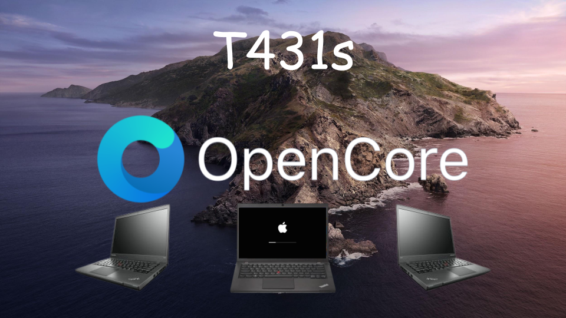

Welcome to the T431s hackintosh! First Lenovo Thinkpad T431s to support Opencore! We have changed plans and we want to have regular updates! I have seen lots of people asking about the T431s but no one rlly has answers about the machine. Thats where I come in!

Lots of new bug fixes in version 1.1!

donate:

Ethereum: 0xcba18ba3ec9e2248b0a7219b85064fbe388d72b9

Bitcoin: 3LHVSz5J8WE77AwiqZ28hCUhNpNZKP4PWo

DogeCoin: DR7ra67FmG95eqSsapnTn6MevWRc3f6Mcc
  
